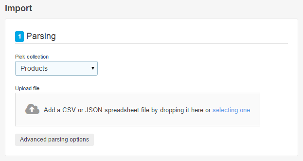
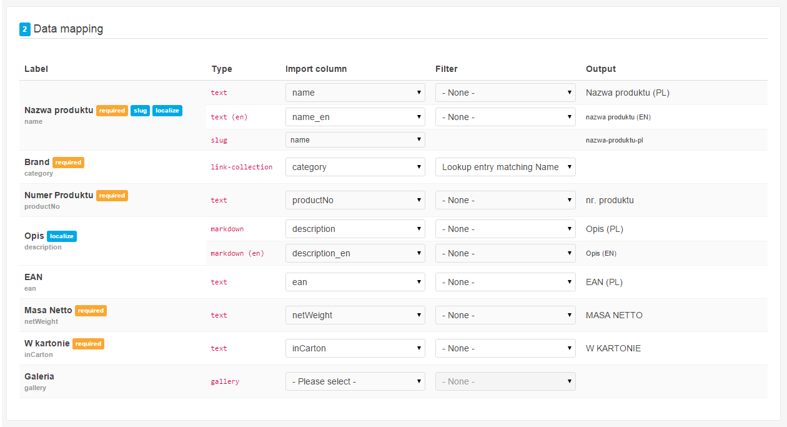
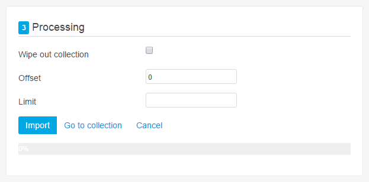

# Spreadsheet import module 

Module for importing spreadsheet as collection entries in [Cockpit CMS](http://getcockpit.com/)


## Features

- Import from CSV files or JSON files
  _(generated by Cockpit collection export functionality)_
- Localization
- Auto-assign fields based on header
  _(Column names must match collection field names)_
- Filters
  - Text
  - Select
  - Boolean
  - Lookup entry matching Name _(for field type `link-collection`, useful for setting up categories)_
    _For multiple collection links, use Vertical bar `|` as a separator._
    _Collection must have field named `name`_
  - Location
    _(Geolocate addresses)_

## Requirements

- Cockpit v0.13
- for CSV files IE10+/ Safari 6+ (see [Papaparse browser compatibility](http://papaparse.com/faq#browsers))


## Installation

1. Download [latest release](https://github.com/piotr-cz/import/releases/latest) and place in `[cockpit-path]/modules/addons/Import` or
   ```sh
   cd [cockpit-path]/modules/addons
   git clone https://github.com/piotr-cz/cockpit-import Import
   ```

2. Open cockpit backend.

3. In top-right corner you'll see _Import_ button.


## Usage

1. Select collection and file

   

2. Map collection fields to spreadsheet columns

   

3. Tune up processing options and click Import

   


## Authors

* [piotr_cz](https://github.com/piotr-cz)


### 3p libraries

* [Papaparse](http://papaparse.com/) (MIT)


## Issues/ Feature requirements

Submit issue or feature requirement [here](https://github.com/piotr-cz/cockpit-import/issues)

[Latest](https://github.com/piotr-cz/import/archive/master.zip) development version


## Licensed under MIT License
